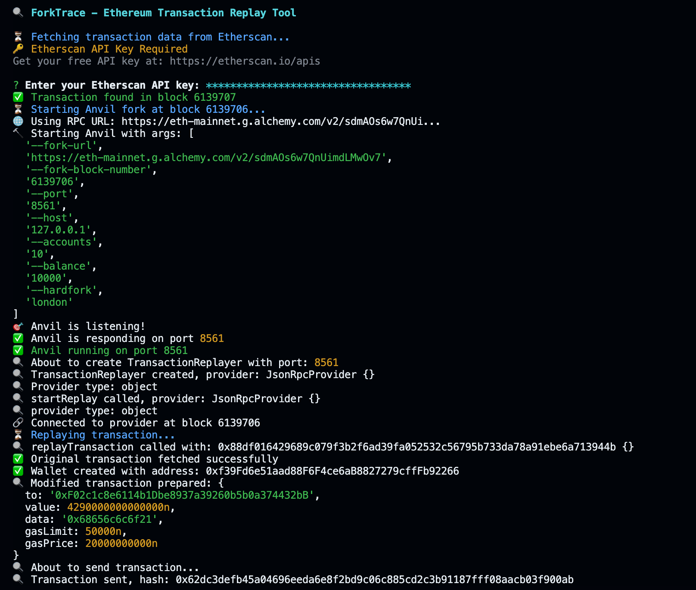
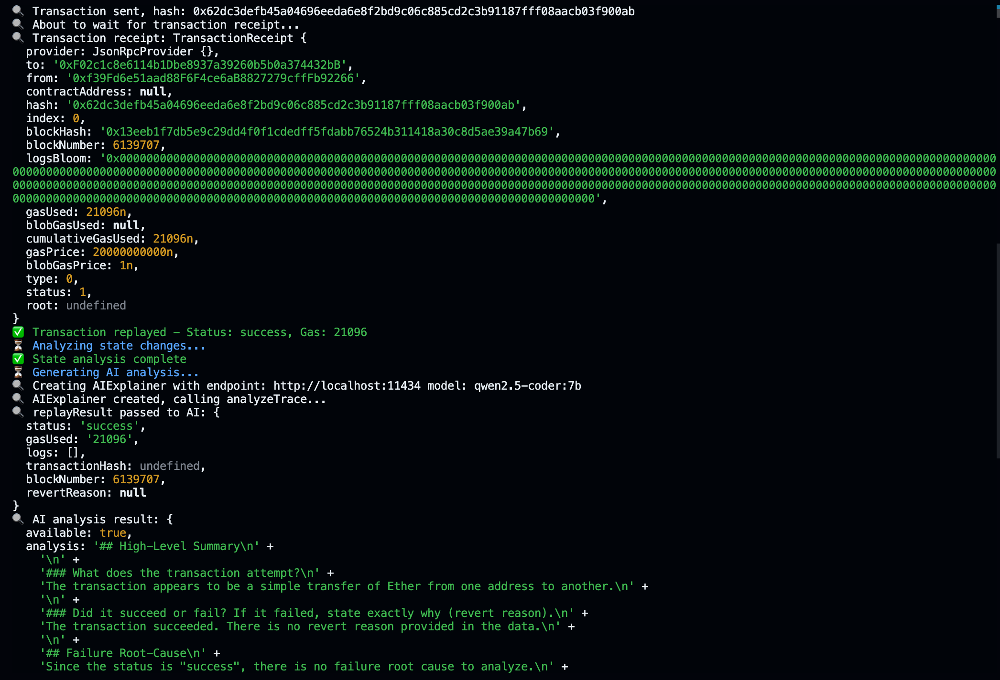
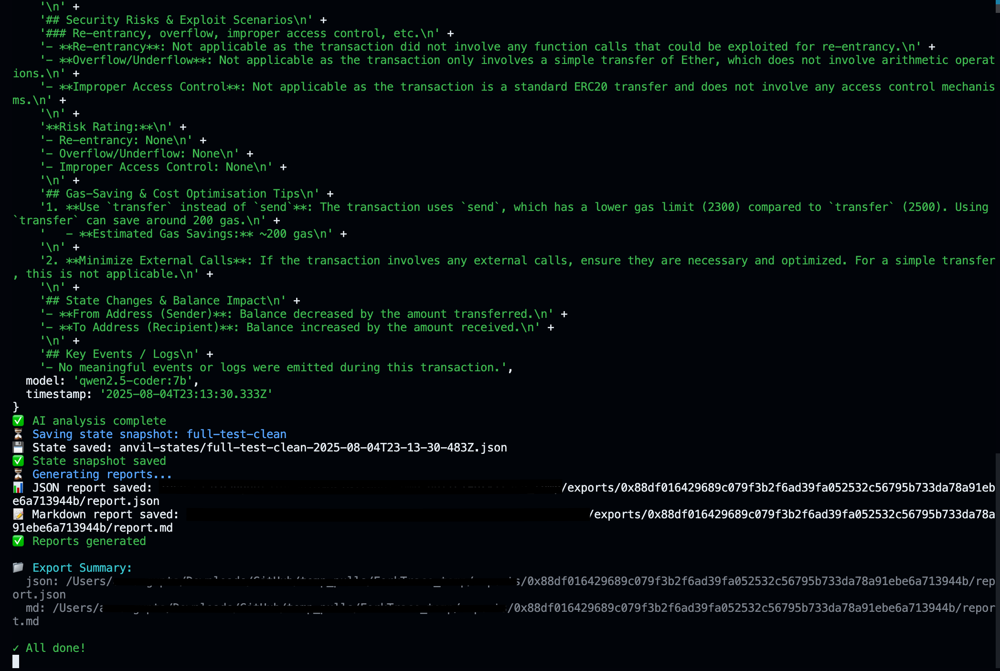

<h1 align="center">ForkTrace</h1>

  <b>Ethereum Transaction Replay + AI Failure Analysis CLI</b> 
  
  
  
  

---

## ✨ Features

- **One-command replay** of any main-net transaction on a local Anvil fork.
- **Modify on the fly** (`--mod '{"value":"0"}'`) to test hypotheses.
- **AI-powered analysis** ([Ollama](https://ollama.com) + open-source LLM of your choice)
- **Automatic failure root-cause** detection & revert-string decoding.
- **State-diff visualisation** (balances, nonces, code changes).
- **Exports** to `json`, `md`, and transaction `trace` files.
- **Snapshot / restore** of forked chain state.
- **Zero-config**—works out of the box with a free Etherscan key.

---

## 🏗️ Architecture

~~~
                                +-----------------------------+
fork-trace CLI  -------------> |   Orchestrator (index.js)   |
                                +-------------+---------------+
                                              |
        +--------------------------+----------+--------------------------+
        |                          |                                     |
+-------v--------+       +---------v--------+               +------------v-----------+
|  Tx Fetcher    |       |  Anvil Forker    |               |   Transaction Replayer |
| (Etherscan)    |       | (Foundry Anvil)  |               |                        |
+----------------+       +------------------+               +------------------------+
                                              |
                                +-------------v-------------+
                                | State Analyzer / Diff Gen |
                                +-------------+-------------+
                                              |
        +--------------------------+----------+--------------------------+
        |                          |                                     |
+-------v--------+       +---------v--------+               +------------v-----------+
| AI Explainer   |       | Exporter (md/JSON)|              |  Snapshot Manager      |
| (Ollama + LLM) |       +-------------------+              +------------------------+
+----------------+
~~~

---

## ⚒️ Installation

### 1. Clone & Install

~~~
git clone https://github.com/techyarnav/ForkTrace.git
cd ForkTrace
npm install
~~~

### 2. Install Anvil (Foundry)
~~~
curl -L https://foundry.paradigm.xyz | bash
foundryup # makes anvil available in $PATH
~~~

### 3. Install Ollama & Pull a Model *(optional but recommended)*

~~~
brew install ollama                                         # for macOS

curl -fsSL https://ollama.com/install.sh | sh               # for Linux

iwr https://ollama.com/install.ps1 -UseBasicParsing | iex   # for Windows (via PowerShell):
~~~

~~~
ollama serve & # starts the local LLM server

ollama pull qwen2.5-coder:7b # high-quality code-oriented model

ollama pull tinyllama:chat 

ollama pull deepseek-coder:6.7b 

ollama pull codellama:13b 

ollama pull wizardcoder:13b 

ollama pull phi3:mini  
~~~

### 4. Set your Etherscan API key

~~~
export ETHERSCAN_API_KEY="YourRealKeyHere"
~~~

---

## 🚀 Usage

~~~
fork-trace --help
~~~
~~~
Usage: fork-trace [options] <txHash>

Replay Ethereum mainnet transactions using Anvil with AI-powered analysis

Arguments:
  txHash               Ethereum transaction hash to replay

Options:
  -V, --version        output the version number
  --anvil-port <port>  port for Anvil instance (default: 8545)
  --mod <json>         modify transaction fields (JSON)
  --ai                 enable AI-powered transaction analysis (requires ollama)
  --ai-endpoint <url>  AI service endpoint (default: "http://localhost:11434")
  --ai-model <name>    AI model name (default: "tinyllama:chat")
  --export <formats>   export formats (comma-separated): json,md,trace,all
  --output-dir <dir>   export directory (default: "./exports")
  --save-state <name>  save Anvil state snapshot with this name
  --state-dir <dir>    directory for state snapshots (default: "./anvil-states")
  --no-color           disable colored output
  -h, --help           display help for command

Examples:
  $ fork-trace 0x1234...abcd
  $ fork-trace 0x1234...abcd --export json,md
  $ fork-trace 0x1234...abcd --ai --export all
  $ fork-trace 0x1234...abcd --mod '{"value":"0"}' --save-state before-mod
  $ fork-trace 0x1234...abcd --anvil-port 8546 --output-dir ./reports
  
Prerequisites:
  - Anvil (from Foundry toolkit)
  - Etherscan API key in environment: ETHERSCAN_API_KEY
  - Ollama running locally (optional, for AI analysis)
~~~

1. Simple replay
~~~
fork-trace 0x88df0164... --anvil-port 8555
~~~
2. Modify value to 0 and export JSON
~~~
fork-trace 0x88df0164... --mod '{"value":"0"}' --export json
~~~
3. AI analysis with Qwen 7 B model
~~~
fork-trace 0x88df0164... --ai --ai-model "qwen2.5-coder:7b"
~~~
4. Save state snapshot
~~~
fork-trace 0x88df0164... --save-state
~~~
#
~~~
fork-trace 0x88df016429689c079f3b2f6ad39fa052532c56795b733da78a91ebe6a713944b \
  --ai --ai-model "qwen2.5-coder:7b" \
  --export json,md \
  --save-state full-test-clean \
  --anvil-port 8561
~~~

 
 

#

Common flags:

| Flag | Description |
|------|-------------|
| `--mod <json>` | Override any tx field (`value`, `data`, `gasPrice` …) |
| `--ai` | Enable AI analysis (needs Ollama running) |
| `--ai-model <name>` | Pick an Ollama model (default `tinyllama:chat`) |
| `--export <fmt>` | Comma-sep list: `json,md,trace,all` |
| `--save-state <name>` | Dump a snapshot of the forked chain |
| `--anvil-port 
` | Run Anvil on a custom port |

---

## 🧰 Tech Stack
| Layer | Library / Tool |
|-------|----------------|
| CLI / args | `commander`, `chalk` |
| Ethereum provider | `ethers.js v6` |
| Forked chain | **Anvil** (Foundry) |
| AI | **Ollama** + open-source LLM (TinyLlama, Qwen, DeepSeek R1 …) |
| HTTP | `axios` |
| Bundler | Node 20+ (ESM/TS ready) |

---
## 🤝 Contributing - We welcome contributions! Please see our Contributing Guide for details.

- Fork the repository

- Create your feature branch (git checkout -b feature/amazing-feature)

- Commit your changes (git commit -m 'Add features')

- Push to the branch (git push origin feature/amazing-feature)

- Open a Pull Request

#

## 📄 License

This project is licensed under the **MIT License** — see the [LICENSE](./LICENSE) file for details.

#

⭐️ Star this repository if it saved you hours debugging Ethereum transactions or helped you understand a failure!

 Built with ❤️ using <strong>Node.js</strong>, <strong>ethers.js</strong>, <strong>Foundry (Anvil)</strong>, and <strong>Ollama</strong>. 

#